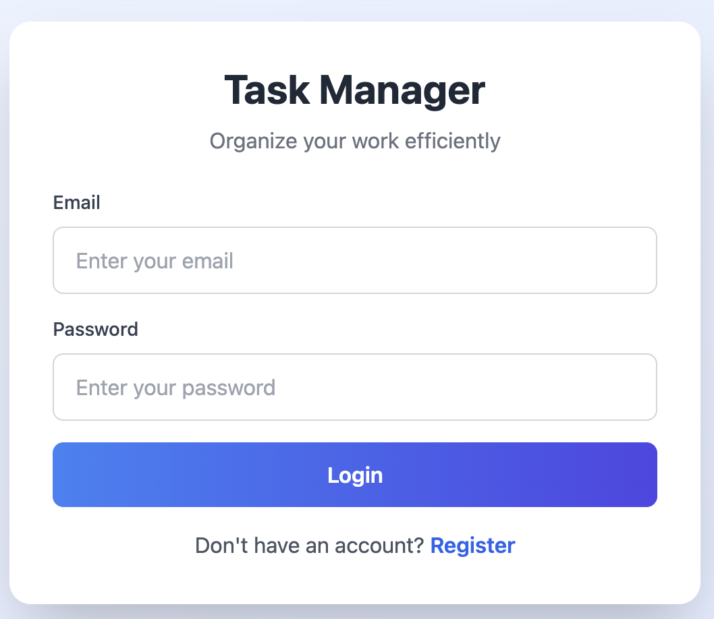
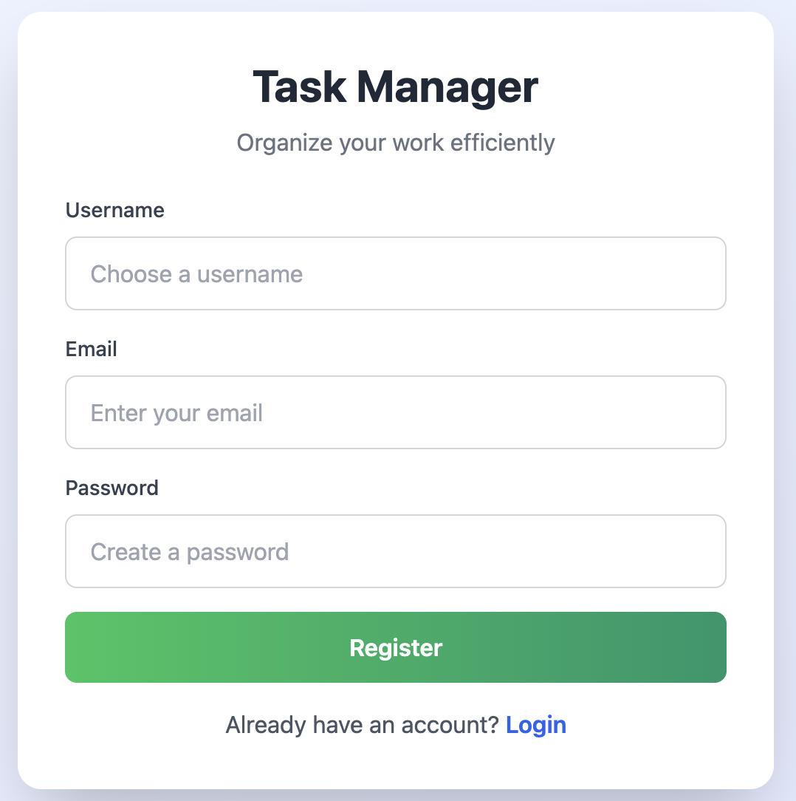
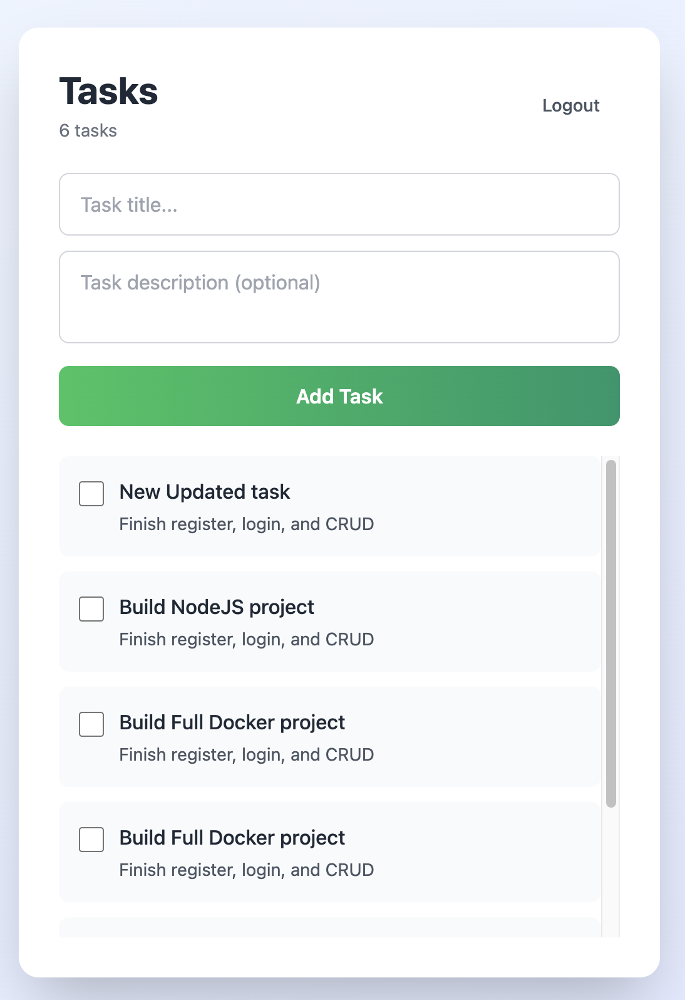

# Task Manager - FastAPI + JavaScript

A full-stack task management application built with **FastAPI** backend and **vanilla JavaScript** frontend. Features user authentication, task CRUD operations, and a modern, responsive UI powered by **Tailwind CSS**.

## 📋 Table of Contents

- [Features](#features)
- [Tech Stack](#tech-stack)
- [Project Structure](#project-structure)
- [Installation & Setup](#installation--setup)
- [Running the Project](#running-the-project)
- [API Documentation](#api-documentation)
- [Database Schema](#database-schema)
- [Frontend Features](#frontend-features)
- [Screenshots](#screenshots)
- [Usage Guide](#usage-guide)
- [Environment Variables](#environment-variables)
- [Contributing](#contributing)

## ✨ Features

### Authentication
- ✅ User registration with email and username validation
- ✅ Secure login with JWT token authentication
- ✅ Password hashing with bcrypt
- ✅ Token-based session management
- ✅ Auto-login with localStorage persistence

### Task Management
- ✅ Create tasks with title and description
- ✅ Edit tasks (update title, description, and completion status)
- ✅ Delete tasks with confirmation dialog
- ✅ Mark tasks as complete/incomplete (toggle)
- ✅ View task count and list
- ✅ Filter tasks by user (isolated tasks per user)

### User Interface
- ✅ Modern, clean design with Tailwind CSS
- ✅ Fully responsive layout
- ✅ Card-based design
- ✅ Blue & white professional color scheme
- ✅ Smooth transitions and hover effects
- ✅ Form validation with user feedback
- ✅ Modal for task editing

## 🛠 Tech Stack

### Backend
- **FastAPI** - Modern, fast web framework for building APIs
- **SQLAlchemy** - SQL toolkit and ORM
- **SQLite** - Lightweight relational database
- **Pydantic** - Data validation using Python type annotations
- **Password-validator** - Secure password hashing with bcrypt
- **Python-Jose** - JWT token generation and validation
- **Uvicorn** - ASGI server for running FastAPI

### Frontend
- **HTML5** - Semantic markup
- **CSS3 + Tailwind CSS** - Utility-first CSS framework (CDN)
- **Vanilla JavaScript** - DOM manipulation and API calls
- **Fetch API** - HTTP requests

## 📁 Project Structure

```
Task-Manager-fastAPI/
├── app/
│   ├── __pycache__/
│   ├── routers/
│   │   ├── __pycache__/
│   │   ├── auth.py              # Authentication endpoints
│   │   └── tasks.py             # Task CRUD endpoints
│   ├── auth.py                  # JWT and password utilities
│   ├── database.py              # SQLAlchemy connection
│   ├── deps.py                  # Dependency injection
│   ├── main.py                  # FastAPI app setup
│   ├── models.py                # SQLAlchemy models
│   └── schemas.py               # Pydantic schemas
├── pictures/
│   ├── login_page.png           # Login UI screenshot
│   ├── register_page.png        # Registration UI screenshot
│   └── tasks_page.png           # Tasks dashboard screenshot
├── app.js                       # Frontend JavaScript logic
├── index.html                   # Frontend HTML template
├── requirements.txt             # Python dependencies
├── run.sh                       # Shell script to start the server
├── Makefile                     # Build automation
├── tasks.db                     # SQLite database (auto-generated)
├── .env.example                 # Environment variables template
└── README.md                    # This file
```

## 🚀 Installation & Setup

### Prerequisites
- Python 3.8 or higher
- pip (Python package manager)
- Git (optional)

### Step 1: Clone or Download the Project

```bash
cd Task-Manager-fastAPI
```

### Step 2: Create Virtual Environment

**macOS/Linux:**
```bash
python3 -m venv venv
source venv/bin/activate
```

**Windows:**
```bash
python -m venv venv
venv\Scripts\activate
```

### Step 3: Install Dependencies

```bash
pip install -r requirements.txt
```

### Step 4: Setup Environment Variables

```bash
cp .env.example .env
```

Edit `.env` file and set a strong secret key for JWT:
```
SECRET_KEY=your_very_strong_secret_key_here_at_least_32_characters
```

### Step 5: Initialize Database

The database will be created automatically when you first run the application. SQLAlchemy will create the `tasks.db` SQLite file and all necessary tables.

## ▶️ Running the Project

### Using the Run Script (Recommended)

**macOS/Linux:**
```bash
./run.sh
```

**Windows:**
```bash
.\run.sh
# or
bash run.sh
```

### Manual Startup

```bash
source venv/bin/activate  # macOS/Linux
# or venv\Scripts\activate (Windows)

uvicorn app.main:app --reload
```

### Access the Application

- **Frontend**: Open your browser and go to `http://127.0.0.1:8000`
- **API Docs**: Visit `http://127.0.0.1:8000/docs` for interactive API documentation
- **API Swagger**: Visit `http://127.0.0.1:8000/redoc` for ReDoc API documentation

## 📡 API Documentation

### Base URL
```
http://127.0.0.1:8000
```

### Authentication Endpoints

#### Register User
```
POST /auth/register
Content-Type: application/json

{
  "username": "john_doe",
  "email": "john@example.com",
  "password": "secure_password_123"
}

Response (201):
{
  "id": 1,
  "username": "john_doe",
  "email": "john@example.com"
}
```

#### Login User
```
POST /auth/login
Content-Type: application/json

{
  "email": "john@example.com",
  "password": "secure_password_123"
}

Response (200):
{
  "access_token": "eyJhbGciOiJIUzI1NiIsInR5cCI6IkpXVCJ9...",
  "token_type": "bearer"
}
```

### Task Endpoints

**Authorization Header Required**: `Authorization: Bearer {access_token}`

#### Create Task
```
POST /tasks/
Content-Type: application/json
Authorization: Bearer {token}

{
  "title": "Buy groceries",
  "description": "Milk, eggs, and bread"
}

Response (201):
{
  "id": 1,
  "title": "Buy groceries",
  "description": "Milk, eggs, and bread",
  "completed": false,
  "owner_id": 1
}
```

#### Get All Tasks
```
GET /tasks/
Authorization: Bearer {token}

Response (200):
[
  {
    "id": 1,
    "title": "Buy groceries",
    "description": "Milk, eggs, and bread",
    "completed": false,
    "owner_id": 1
  },
  ...
]
```

#### Get Single Task
```
GET /tasks/{task_id}
Authorization: Bearer {token}

Response (200):
{
  "id": 1,
  "title": "Buy groceries",
  "description": "Milk, eggs, and bread",
  "completed": false,
  "owner_id": 1
}
```

#### Update Task
```
PUT /tasks/{task_id}
Content-Type: application/json
Authorization: Bearer {token}

{
  "title": "Buy groceries",
  "description": "Updated description",
  "completed": true
}

Response (200):
{
  "id": 1,
  "title": "Buy groceries",
  "description": "Updated description",
  "completed": true,
  "owner_id": 1
}
```

#### Delete Task
```
DELETE /tasks/{task_id}
Authorization: Bearer {token}

Response (200):
{
  "detail": "Task deleted successfully"
}
```

## 🗄️ Database Schema

### Users Table
```sql
CREATE TABLE users (
  id INTEGER PRIMARY KEY,
  username VARCHAR UNIQUE NOT NULL,
  email VARCHAR UNIQUE NOT NULL,
  hashed_password VARCHAR NOT NULL
);
```

### Tasks Table
```sql
CREATE TABLE tasks (
  id INTEGER PRIMARY KEY,
  title VARCHAR NOT NULL,
  description VARCHAR,
  completed BOOLEAN DEFAULT FALSE,
  owner_id INTEGER NOT NULL,
  FOREIGN KEY (owner_id) REFERENCES users(id) ON DELETE CASCADE
);
```

### Relationships
- One-to-Many: A user can have multiple tasks
- Cascade Delete: When a user is deleted, all their tasks are deleted

## 🎨 Frontend Features

### Login Page
- Email and password input fields
- Form validation
- Switch to register mode
- Error alerts for failed login

### Registration Page
- Username, email, and password input fields
- Password length validation (minimum 6 characters)
- Duplicate email/username checking
- Success notification with auto-switch to login

### Tasks Dashboard
- **Header** with task count and logout button
- **Add Task Form** with:
  - Task title input (required)
  - Task description textarea (optional)
  - Add button to create task
- **Task List** displaying:
  - Checkbox to toggle completion status
  - Task title and description
  - Visual strikethrough for completed tasks
  - Edit button (appears on hover)
  - Delete button with confirmation (appears on hover)
- **Empty State** message when no tasks exist
- **Edit Modal** for updating tasks with:
  - Title field
  - Description field
  - Completion status checkbox
  - Save and Cancel buttons

## 📸 Screenshots

### Login Page

- Clean, modern login interface
- Email and password fields
- "Register" link to create new account
- Blue gradient login button

### Registration Page

- Username, email, and password input fields
- Form validation feedback
- "Login" link to return to login
- Green gradient register button

### Tasks Dashboard

- Task creation form with title and description
- Complete list of user's tasks
- Edit and delete buttons on hover
- Checkbox for marking tasks complete
- Task counter showing total tasks
- Logout button in header

## 📖 Usage Guide

### 1. Register a New Account
- Fill in username, email, and password
- Click "Register"
- Receive success confirmation
- Will be directed to login form

### 2. Login
- Enter your email and password
- Click "Login"
- Redirected to tasks dashboard
- Token saved in localStorage for auto-login

### 3. Create a Task
- Enter task title (required)
- Enter task description (optional)
- Click "Add Task"
- Task will appear in your list

### 4. Edit a Task
- Click "Edit" button on the task (appears on hover)
- Modal will open with task details
- Modify title, description, or completion status
- Click "Save" to update
- Click "Cancel" to discard changes

### 5. Mark Task Complete/Incomplete
- Click the checkbox next to a task
- Task will toggle between complete/incomplete
- Completed tasks show strikethrough styling

### 6. Delete a Task
- Click "Delete" button on the task (appears on hover)
- Confirm deletion in the dialog
- Task will be removed from your list

### 7. Logout
- Click "Logout" button in the top-right
- Token will be cleared from localStorage
- Return to login page

## ⚙️ Environment Variables

Create a `.env` file in the root directory with the following variables:

```env
# JWT Secret Key (use a long, random string)
SECRET_KEY=your_very_strong_secret_key_here_minimum_32_characters_recommended
```

**Important:** 
- Change the `SECRET_KEY` to a unique, strong value
- Never commit the `.env` file to version control
- Keep your SECRET_KEY secure and private

## 🔐 Security Features

- ✅ Password hashing with bcrypt (not stored in plain text)
- ✅ JWT token-based authentication
- ✅ CORS enabled for frontend-backend communication
- ✅ User data isolation (users can only see their own tasks)
- ✅ Input validation with Pydantic
- ✅ SQL injection prevention via SQLAlchemy ORM
- ✅ Email validation
- ✅ Unique username and email constraints

## 🤝 Contributing

Contributions are welcome! To contribute:

1. Fork the repository
2. Create a feature branch (`git checkout -b feature/AmazingFeature`)
3. Commit changes (`git commit -m 'Add some AmazingFeature'`)
4. Push to the branch (`git push origin feature/AmazingFeature`)
5. Open a Pull Request

## 📝 License

This project is open source and available under the MIT License.

## 🐛 Troubleshooting

### Port 8000 is already in use
```bash
# Kill the process using port 8000 (macOS/Linux)
lsof -ti:8000 | xargs kill -9

# Or run on a different port
uvicorn app.main:app --reload --port 8001
```

### Virtual environment not activating
```bash
# Make sure you're in the project directory
cd Task-Manager-fastAPI

# Try with full path
source $(pwd)/venv/bin/activate
```

### Database errors
```bash
# Delete and recreate the database
rm tasks.db
# Run the app again - database will be recreated
uvicorn app.main:app --reload
```

### Module not found errors
```bash
# Reinstall dependencies
pip install -r requirements.txt --force-reinstall
```

## 📞 Support

For issues, questions, or suggestions, please create an issue in the repository.

---

**Happy Task Managing! 🎉**

Built with ❤️ using FastAPI and JavaScript
